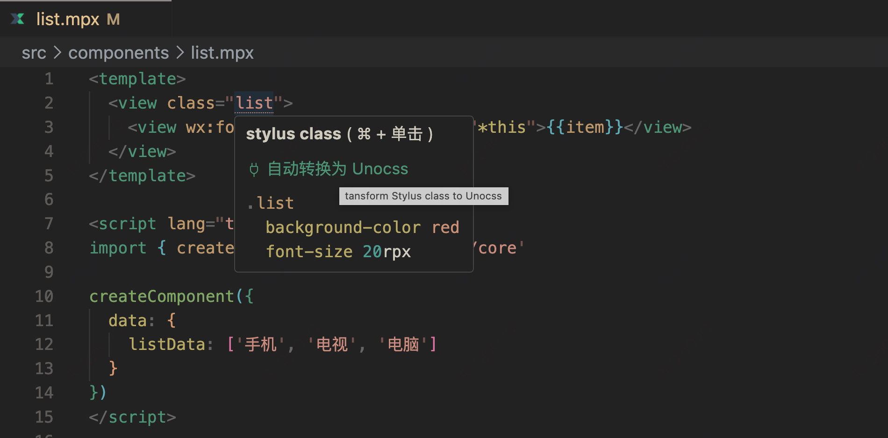
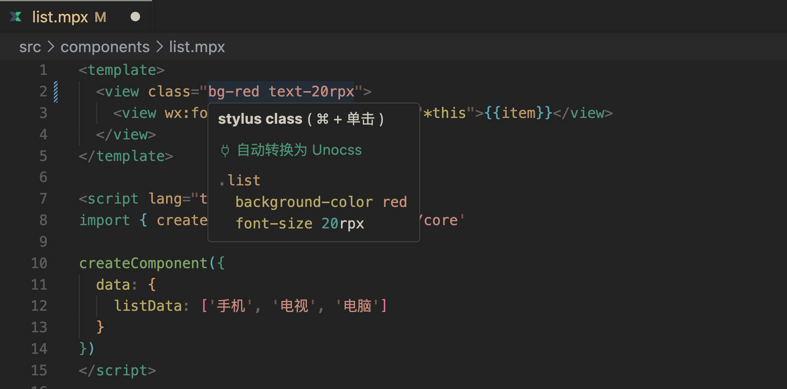

 

<h1 align="center">Mpx Template Features for VS Code</h1>

 

## ⚡ 插件 Features

1. 🚀 **定义跳转**：`<template>` 支持 `定义跳转`（附带下划线样式）：自定义标签名，类名，属性中的变量、方法名
   - template 中属性的 `变量、方法` 支持跳转到 `<script> 中的定义位置`
   - template 中的 `class 类名` 支持跳转到 `<style> 样式脚本对应位置`
   - template 中的 `自定义的组件标签名` 支持跳转到 `自定义组件所在的文件`
2. 🚀 **Hover**：`class 类名` hover 展示对应的 style 样式片段
   - **自动转为原子类**：`hover` 中支持将 `stylus class` 对应的样式一键转换为 `Unocss`
3. 🚀 **自动补全**：注意 class 等属性值默认不支持自动补全，可以通过 `{`、`(`, `'`、`"` 等符号主动唤起自动触发
4. 🚀 **视图拆分**：支持拆分 SFC 文件为多个编辑视图。比如同时在左侧/上侧编写 `<script>`，右侧/下侧编写 `<template>`

## 演示

<!--  -->

- `class` 样式 `hover` 效果，可自动转换为原子类 `Unocss`
  
   

   

- 定义跳转
  
   

- 视图拆分
  
   

<!-- ## 发布
vscode 插件发布流程：
# npm i vsce -g
1. vsce login wangshun（登录过就不用再登录了，登录过期后需要重新申请vscode token，参考: https://dev.azure.com/wangshunnn/_usersSettings/tokens, https://code.visualstudio.com/api/working-with-extensions/publishing-extension#get-a-personal-access-token）
2. npm run pack（打包 vsce package）
3. npm run publish:patch（自动更新小版本并且发布 vsce publish patch）
4. 发布成功后 push 代码和 tag
5. git push origin main
6. git push origin --tags v1.0.x
-->
