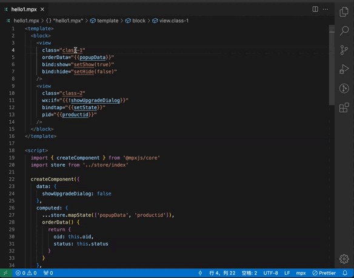
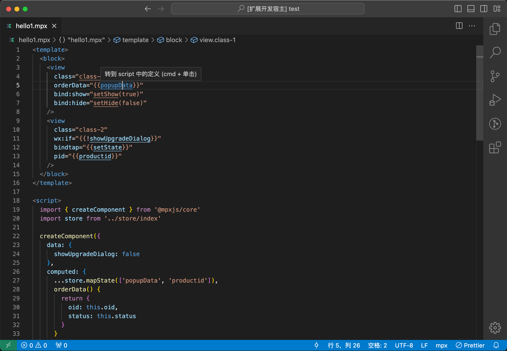
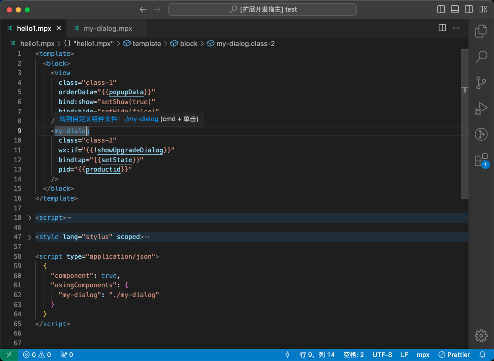

 

<h1 align="center">Mpx Template Features for VS Code</h1>

 

## ⚡ 插件 Features

1. template 中增加可跳转的 `下划线样式`：自定义标签名，类名，属性中的变量、方法名
2. template 中属性的 `变量、方法` 支持跳转到 `<script> 中的定义位置`
3. template 中的 `class 类名` 支持跳转到 `<style> 样式脚本对应位置`
4. template 中的 `自定义的组件标签名` 支持跳转到 `自定义组件所在的文件` （目前仅支持 `<script type="application/json">` 中配置的自定义组件，不久会支持 `<script name="json">` ）

## 演示

## 示例

- 鼠标放在可跳转的类名、变量、方法名时会有对应的跳转提示，`cmd+单击` 或 `右键-转到定义` 可直接跳转到对应定义位置，`class` 类名点击则会跳转到 `<style>` 中对应的样式。

  

- 鼠标放在可跳转的自定义组件标签上时会有对应的跳转提示，`cmd+单击` 或 `右键-转到定义` 可直接跳转到组件对应的文件。

  
